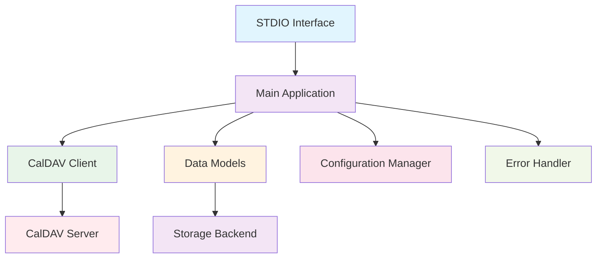

# MCP CalDAV STDIO Application Architecture

## Overview
This document outlines the architecture for a Python-based MCP (Model Communication Protocol) CalDAV STDIO application that provides CRUD operations for events, journals, and todos using the caldav Python library.

## System Components

### 1. Core Modules
- **Main Application**: Entry point and main execution logic
- **CalDAV Client**: Handles connection and communication with CalDAV server
- **Data Models**: Represent events, journals, and todos
- **STDIO Interface**: MCP protocol implementation for communication
- **Configuration Manager**: Handles application settings and credentials
- **Error Handler**: Centralized error management and logging

### 2. Data Models
- **Event**: Calendar events with start/end times, description, location, etc.
- **Journal**: Personal journal entries with date, content, tags, etc.
- **Todo**: Task items with due dates, completion status, priority, etc.

### 3. Operations
Each data type supports full CRUD operations:
- Create (C)
- Read (R) 
- Update (U)
- Delete (D)

## Architecture Diagram

## Data Flow

1. STDIO Interface receives commands from MCP client
2. Main Application processes the command and routes to appropriate handler
3. CalDAV Client handles communication with the CalDAV server
4. Data Models represent and transform the data as needed
5. Configuration Manager provides settings and credentials
6. Error Handler manages exceptions and logging

## MCP Protocol Implementation

The application will implement the standard MCP protocol for STDIO communication:
- Standard input/output for command exchange
- JSON-based message format
- Proper error handling and response formatting