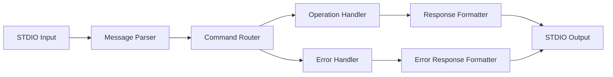

# MCP Protocol Implementation Plan

## Overview
This document outlines the implementation plan for the Model Communication Protocol (MCP) STDIO interface that will allow our CalDAV application to communicate with MCP clients.

## MCP Protocol Basics

The MCP protocol uses STDIO (standard input/output) for communication between the client and server. Messages are sent as JSON objects over standard input, and responses are sent as JSON objects over standard output.

## Message Format

### Request Format
```json
{
  "jsonrpc": "2.0",
  "id": "unique-request-id",
  "method": "method-name",
  "params": {
    "param1": "value1",
    "param2": "value2"
  }
}
```

### Response Format
```json
{
  "jsonrpc": "2.0",
  "id": "unique-request-id",
  "result": {
    "data": "response-data"
  }
}
```

### Error Response Format
```json
{
  "jsonrpc": "2.0",
  "id": "unique-request-id",
  "error": {
    "code": 1001,
    "message": "Error description"
  }
}
```

## Required Methods

### 1. Event Operations
- `caldav.event.create`: Create a new event
- `caldav.event.read`: Read an existing event
- `caldav.event.update`: Update an existing event
- `caldav.event.delete`: Delete an event

### 2. Journal Operations
- `caldav.journal.create`: Create a new journal entry
- `caldav.journal.read`: Read an existing journal entry
- `caldav.journal.update`: Update an existing journal entry
- `caldav.journal.delete`: Delete a journal entry

### 3. Todo Operations
- `caldav.todo.create`: Create a new todo item
- `caldav.todo.read`: Read an existing todo item
- `caldav.todo.update`: Update an existing todo item
- `caldav.todo.delete`: Delete a todo item

### 4. List Operations
- `caldav.event.list`: List all events
- `caldav.journal.list`: List all journal entries
- `caldav.todo.list`: List all todo items

## Implementation Approach

### STDIO Interface Components

1. **Message Parser**: Parse incoming JSON messages from STDIO
2. **Command Router**: Route commands to appropriate handlers
3. **Response Formatter**: Format responses according to MCP protocol
4. **Error Handler**: Handle and format errors properly

### Message Flow Diagram



## Data Structures for Operations

### Event Operations
- **Create**: Accepts event properties, returns created event with ID
- **Read**: Accepts event ID, returns event data
- **Update**: Accepts event ID and updated properties, returns updated event
- **Delete**: Accepts event ID, returns confirmation

### Journal Operations
- **Create**: Accepts journal properties, returns created journal with ID
- **Read**: Accepts journal ID, returns journal data
- **Update**: Accepts journal ID and updated properties, returns updated journal
- **Delete**: Accepts journal ID, returns confirmation

### Todo Operations
- **Create**: Accepts todo properties, returns created todo with ID
- **Read**: Accepts todo ID, returns todo data
- **Update**: Accepts todo ID and updated properties, returns updated todo
- **Delete**: Accepts todo ID, returns confirmation

## Error Handling

### Standard Error Codes
- `1001`: Invalid parameters
- `1002`: Resource not found
- `1003`: Authentication failed
- `1004`: Internal server error
- `1005`: Operation not supported

### Error Response Structure
```json
{
  "jsonrpc": "2.0",
  "id": "request-id",
  "error": {
    "code": 1001,
    "message": "Error description",
    "data": {
      "field": "invalid-field-name"
    }
  }
}
```

## Configuration Requirements

The application should support configuration through:
- Environment variables
- Configuration file (JSON format)
- Command-line arguments

## Testing Considerations

- Unit tests for each operation method
- Integration tests for STDIO interface
- End-to-end tests with mock CalDAV server
- Error condition testing